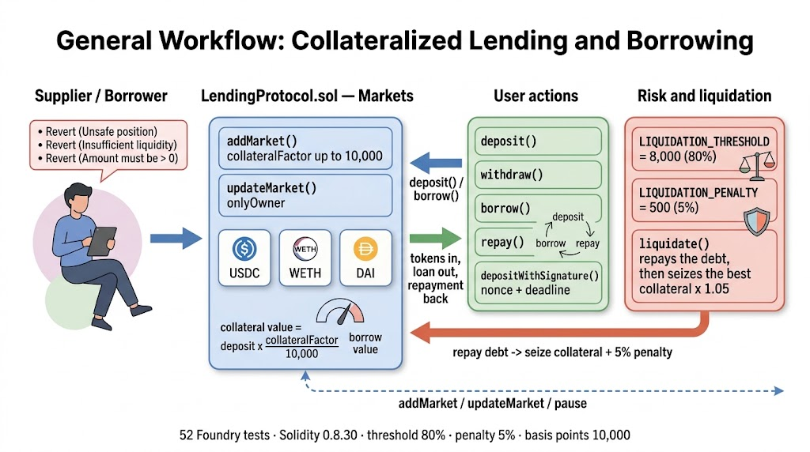

<div align="center">
  <h1>🏦 Lending and Borrowing — Collateralized DeFi Money Market</h1>
  <p><b>A multi-market lending protocol with configurable collateral factors, collateralized borrowing, automatic liquidations and signature-gated deposits</b></p>
</div>

## 📖 About the Project

**Lending and Borrowing** is a production-ready DeFi Smart Contract project built with **Solidity** `0.8.30` and thoroughly tested using the **Foundry** framework. It implements the core of a money market: the owner lists ERC20 markets with their own collateral factor and rate parameters, suppliers deposit into a market, and borrowers open collateralized loans against their position — all accounted per market and per user.

Risk management is explicit and entirely onchain. Every withdrawal and every borrow is validated against the same rule: the collateralization ratio, computed from each market's collateral factor, has to stay at or above the liquidation threshold. Positions that fall below it become liquidatable by anyone, and the protocol handles the whole seizure itself — it repays the debt from the liquidator, picks the borrower's strongest collateral and transfers it with a penalty on top. The repository also ships the operational pieces a real deployment needs: pausability, reentrancy protection, a signature-gated deposit path and an owner-only recovery function for tokens sent by mistake.

**Key Technical Highlights:**
* **Solidity `0.8.30`:** 19 custom errors instead of revert strings, `nonReentrant` on every state-changing entry point and a `whenNotPaused` circuit breaker.
* **OpenZeppelin Contracts:** `SafeERC20` for token movement, plus `ReentrancyGuard`, `Pausable`, `Ownable`, `ECDSA` and `MessageHashUtils`.
* **Multi-market design:** Any number of ERC20 markets, each with its own collateral factor and supply/borrow rate parameters, tracked in a `Market` struct.
* **Onchain risk parameters:** `LIQUIDATION_THRESHOLD = 8_000` (80%), `LIQUIDATION_PENALTY = 500` (5%) and `BASIS_POINT = 10_000`, all exposed through getters.
* **Foundry Framework:** A 52-case suite covering market administration, every user flow, the liquidation path, the signature flow, pausing, reentrancy protection and the mock token.

---

## ⚙️ How It Works

The protocol keeps three layers of state. `Market` holds what is global to a listed token: the total supplied and borrowed, the collateral factor and the rate parameters. `User` holds the aggregate totals and the last update timestamp. Then two nested mappings store the per-user, per-token deposit and borrow balances, which are the numbers every risk check is derived from.

Collateral is valued with the market's own collateral factor: a deposit of `d` tokens contributes `d * collateralFactor / 10_000` to the user's collateral value, while the debt contributes its nominal amount. The collateralization ratio is the first divided by the second, in basis points, and it must remain at or above `LIQUIDATION_THRESHOLD` (80%). Note that both sides of that comparison are token amounts, not prices — the protocol is price-oracle free by design, so it treats every listed token as having the same unit value. The market rate parameters are stored and updatable by the owner, and balances are tracked as principal amounts; the current implementation does not compound them over time.

A position naturally has two protection points. `canWithdraw` recomputes the ratio with the requested amount removed from that user's deposit and rejects the withdrawal if it would drop below the threshold, and `canBorrow` does the same with the requested amount added to the debt. Both short-circuit to `true` when the user has no debt at all, which is what allows a first borrow.

Liquidation is permissionless. Anyone can call `liquidate` on a position whose ratio is under the threshold: the liquidator pays the debt portion being closed, the protocol reduces the borrower's debt and then seizes `amount * (10_000 + LIQUIDATION_PENALTY) / 10_000` — the same value plus 5% — from the borrower's strongest collateral, chosen by `_findBestCollateral`, which walks the supported tokens and picks the largest collateral-factor-weighted deposit. Because the collateral factor of a market can be updated by the owner, a market parameter change can move an existing position below the threshold; the test suite exercises exactly that scenario.

Signature-gated deposits add a second authorization path. `depositWithSignature` requires a signed message over the operation name, the token, a nonce and a deadline, verified through `ECDSA` against `msg.sender`, and the `onlyValidSignature` modifier consumes the nonce atomically after the call so a signature cannot be replayed.

### Architecture Diagram



### Core Component File Paths

[LendingProtocol.sol](./src/LendingProtocol.sol) - Markets, deposits, borrowing, risk checks and liquidations

[MockToken.sol](./src/MockToken.sol) - ERC20 with configurable decimals used by the tests

[LendingProtocolTest.t.sol](./test/LendingProtocolTest.t.sol) - 52-case Foundry suite for the protocol and the mock token

## 💻 Technical Docs

The primary interaction points are `addMarket` (risk configuration), `deposit` (supply), `getCollateralizationRatio` (the rule every check is built on) and `liquidate` (the enforcement path).

### addMarket
File: src/LendingProtocol.sol

```Solidity
    function addMarket(
        address token, 
        uint256 collateralFactor, 
        uint256 inititalSupplyRate, 
        uint256 initialBorrowRate
    ) external onlyOwner {
        if (token == address(0)) revert LendingProtocol__InvalidTokenAddress();
        if (collateralFactor > BASIS_POINT) revert LendingProtocol__InvalidCollateralFactor();
        if (s_markets[token].isActive) revert LendingProtocol__MarketAlreadyExists();

        s_markets[token] = Market({
            token: IERC20(token),
            totalSupply: 0,
            totalBorrow: 0,
            supplyRate: inititalSupplyRate,
            borrowRate: initialBorrowRate,
            collateralFactor: collateralFactor,
            isActive: true
        });

        s_supportedTokens.push(token);
        emit MarketAdded(token, collateralFactor);
    }
```

### deposit
File: src/LendingProtocol.sol

```Solidity
    function deposit(address token, uint256 amount) external nonReentrant onlyActiveMarket(token) whenNotPaused {
        if (amount <= 0) revert LendingProtocol__AmountMustBeGreaterThanZero();

        IERC20(token).safeTransferFrom(msg.sender, address(this), amount);

        s_userDeposits[msg.sender][token] += amount;
        s_users[msg.sender].totalDeposited += amount;
        s_users[msg.sender].lastUpdateTime = block.timestamp;
        s_users[msg.sender].isActive = true;

        s_markets[token].totalSupply += amount;

        emit Deposit(msg.sender, token, amount);
    }
```

### getCollateralizationRatio
File: src/LendingProtocol.sol

```Solidity
    function getCollateralizationRatio(address user) public view returns (uint256 ratio) {
        uint256 totalCollateralValue = 0;
        uint256 totalBorrowValue = 0;

        for (uint256 i = 0; i < s_supportedTokens.length; i++) {
            address token = s_supportedTokens[i];
            if (s_markets[token].isActive) {
                uint256 depositAmount = s_userDeposits[user][token];
                uint256 borrowAmount = s_userBorrows[user][token];

                if (depositAmount > 0) {
                    totalCollateralValue += (depositAmount * s_markets[token].collateralFactor) / BASIS_POINT;
                }

                if (borrowAmount > 0) {
                    totalBorrowValue += borrowAmount;
                }
            }
        }

        if (totalBorrowValue == 0) return type(uint256).max;
        return (totalCollateralValue * BASIS_POINT) / totalBorrowValue;
    }
```

### liquidate
File: src/LendingProtocol.sol

```Solidity
    function liquidate(address user, address token, uint256 amount)
        external
        nonReentrant
        whenNotPaused
        onlyActiveMarket(token)
    {
        if (amount <= 0) revert LendingProtocol__AmountMustBeGreaterThanZero();
        if (s_userBorrows[user][token] < amount) revert LendingProtocol__InsufficientBurrowToLiquidate();
        if (!isLiquidatable(user)) revert LendingProtocol__PositionIsNotLiquidatable();

        uint256 collateralToSeize = (amount * (BASIS_POINT + LIQUIDATION_PENALTY)) / BASIS_POINT;

        // Find collateral token to seize
        address collateralToken = _findBestCollateral(user);
        if (collateralToken == address(0)) revert LendingProtocol__NoCollateralToSeize();
        if (s_userDeposits[user][collateralToken] < collateralToSeize) {
            revert LendingProtocol__InsufficientCollateral();
        }

        // Transfer Borrowed tokens from liquidator
        IERC20(token).safeTransferFrom(msg.sender, address(this), amount);

        // Update user's borrow
        s_userBorrows[user][token] -= amount;
        s_users[user].totalBorrowed -= amount;
        s_markets[token].totalBorrow -= amount;

        // Seize collateral
        s_userDeposits[user][collateralToken] -= collateralToSeize;
        s_users[user].totalDeposited -= collateralToSeize;
        s_markets[collateralToken].totalSupply -= collateralToSeize;

        // Transfer collateral to liquidator
        IERC20(collateralToken).safeTransfer(msg.sender, collateralToSeize);

        emit Liquidate(msg.sender, user, token, amount);
    }
```

## 🚀 Execution Example

Here is a step-by-step example of the flow the suite exercises, with the values it actually uses.

- Step 1: Deploy and list markets
The owner deploys `LendingProtocol` and three `MockToken`s — `USD Coin (USDC)`, `Wrapped Ether (WETH)` and `Dai (DAI)`, all with 18 decimals and a supply of `1,000,000`. Each is listed with `addMarket(token, 8000, 500, 800)`: an 80% collateral factor and rate parameters of 5% and 8% in basis points. Every market starts with zero liquidity, so supplies have to come in before anyone can borrow.

- Step 2: Supply liquidity
A user approves the protocol and calls `deposit(USDC, 100e18)`. The tokens move in with `safeTransferFrom`, the user's per-token deposit and aggregate total are updated, the market's `totalSupply` grows and `Deposit` is emitted. With no debt yet, the user's collateralization ratio is `type(uint256).max`.

- Step 3: Borrow against the position
The same user calls `borrow(DAI, 50e18)`. The check is `canBorrow`: collateral value is `100 * 8000 / 10000 = 80` against a debt of `50`, giving a ratio of `16000` basis points — comfortably above the `8000` threshold, so the loan goes out and `totalBorrow` grows. Borrowing more than the collateral factor allows would revert with `BorrowWouldExceedCollateralLimit`, and borrowing more than the market holds would revert with `InsufficientLiquidity`.

- Step 4: Repay
`repay(DAI, amount)` pulls the tokens back in and reduces the debt on both the user and the market. When the aggregate debt reaches zero the user's `isActive` flag drops back to false.

- Step 5: Withdraw safely
`withdraw` refuses to leave a position below the threshold: the user can take out everything while there is no debt, but once debt exists the protocol recomputes the ratio with the requested amount removed and reverts with `WithdrawalWouldMakeThePositionUnsafe` if the result would fall under 80%.

- Step 6: Signature-gated deposit
The user signs `keccak256(abi.encodePacked("deposit", token, nonce, deadline))` wrapped with the Ethereum signed-message prefix, and passes the `v, r, s` values inside a `SignatureData` struct. `depositWithSignature` recovers the signer, requires it to equal `msg.sender`, checks the deadline and the nonce, performs the deposit and then increments the nonce. Because the nonce must match `getNonce(user)` exactly and is consumed afterwards, an expired deadline or a reused signature each revert with their own error.

- Step 7: Liquidation
The owner lowers the USDC collateral factor with `updateMarket(USDC, 3000, 500, 800)`. The user's collateral value drops to `100 * 3000 / 10000 = 30` against the same `50` of debt, so the ratio falls to `6000` basis points and `isLiquidatable` returns true. A liquidator then calls `liquidate(user, DAI, 25e18)`: they repay half the debt, and `_findBestCollateral` selects USDC, so the protocol seizes `25 * 1.05 = 26.25 USDC`. The user ends with `25 DAI` of debt and `73.75 USDC` of collateral, and the liquidator keeps the 5% penalty.

- Step 8: Circuit breaker and recovery
`pause()` stops deposits, withdrawals, borrows, repays and liquidations in one call, and `unpause()` restores them. Separately, `emergencyRecover(token, to, amount)` lets the owner rescue tokens that ended up in the contract outside the accounting.

## ⬆️ Installation

Two dependencies are wired as git submodules: `forge-std` and `openzeppelin-contracts`.

```Bash
git clone --recursive https://github.com/k2gutierrez/Lending-and-Borrowing.git
cd LendingAndBorrowing
forge build
```

## 🧪 Testing

`test/LendingProtocolTest.t.sol` is a 52-case suite that runs entirely in-process — no fork or RPC endpoint is required. It covers market administration and its guards, deposits, withdrawals and the unsafe-position rejection, borrowing and its liquidity and collateral limits, repayments, the signature deposit path with expired, replayed and forged signatures, liquidations including the insufficient-collateral and not-liquidatable reverts, the view surface, constant getters, pausing, reentrancy protection and the mock token behavior.

Testing command:
```Bash
forge test -vvv
```

> ⚠️ The committed CI workflow runs `forge fmt --check` and currently fails, because the source files are not formatted to `forge fmt` defaults. Running `forge fmt` fixes it; `forge test` itself passes as-is.

## 📊 Coverage

```Bash
forge coverage
```
